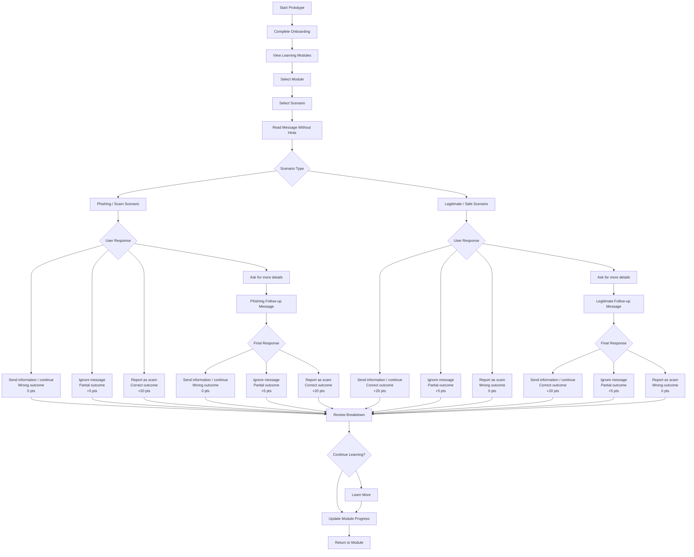

# Spotted: Phishing Recognition and Response Prototype

## 1. Project Overview

Spotted is an interactive mobile prototype designed for the ICT20025 User Experience Design project. The project focuses on phishing recognition and response, with a clear target group of students and recent graduates who are actively looking for work.

The prototype presents realistic job-search scam scenarios and asks users to make decisions before receiving feedback. Its tagline is:

> Spot scams before they spot you.

From a Business Analyst perspective, the project demonstrates how user needs, decision points, and learning requirements can be translated into a structured prototype experience.

## 2. Project Context

Phishing remains a common security risk because many attacks rely on human decision-making under pressure or uncertainty. In a job-search context, suspicious messages can appear convincing because they may use authority, urgency, or attractive employment opportunities.

Students and recent graduates can be especially exposed to this risk because they often receive messages from unfamiliar recruiters, job platforms, or organisations. They may also have limited experience judging whether a recruitment message is legitimate.

This project responds to that context by designing a prototype that supports active practice. Instead of only explaining phishing signs, Spotted places users in realistic scenarios where they must decide how to respond and then learn from the result.

## 3. Problem Statement

Students and recent graduates may struggle to recognise phishing attempts during the job-search process, especially when messages appear urgent, professional, or linked to employment opportunities.

The product problem is to design an interactive learning experience that helps users practise safe decision-making before sharing personal information, clicking links, or responding to suspicious requests.

## 4. Target Users

Primary users:

- Students seeking internships, part-time work, or graduate opportunities.
- Recent graduates applying for entry-level roles.

Secondary users:

- Young job seekers who receive unfamiliar recruiter messages, job offers, or application requests through digital channels.

These users need a simple, realistic, and low-pressure way to practise recognising suspicious messages and choosing an appropriate response.

## 5. Project Objective

The objective of Spotted is to help students and recent graduates practise decision-making in realistic phishing scenarios related to the job-search process.

The prototype aims to move beyond passive phishing education by requiring users to choose a response first, then receive feedback based on their action. This supports learning through practice, consequence, and explanation.

## 6. Scope

### In Scope

- A mobile prototype focused on phishing recognition and response.
- Job-search related scam scenarios for students and recent graduates.
- Module-based learning structure.
- Scenario screens where users read a suspicious message before receiving hints.
- Decision points where users choose how to respond.
- Feedback screens showing wrong, partial, or correct outcomes.
- Breakdown screens explaining red flags and safe response behaviour.
- Simple progress and scoring logic to show learning progress.

### Out of Scope

- A fully developed working application.
- Real user accounts, login, or database storage.
- Real phishing detection or automated message scanning.
- Real reporting integration with email providers, banks, employers, or government services.
- Backend functionality or production deployment.
- Security monitoring beyond the prototype experience.
- The prototype is designed in Figma and is intended to demonstrate the user experience, not function as a live system.

## 7. Key Requirements

### Functional Requirements

| ID | Requirement | Priority | Prototype Evidence |
|---|---|---|---|
| FR-01 | Users must be able to start the experience through a short onboarding flow. | Must | Welcome, concept intro, how-it-works, and profile selection screens |
| FR-02 | Users must be able to view phishing learning modules related to job-search risks. | Must | Module-based home screen |
| FR-03 | Users must be able to open a module and view its scenarios, score, and completion status. | Must | Module detail popup with scenario list, score, and status |
| FR-04 | Users must be able to read a realistic suspicious message before receiving any hints or red flag explanations. | Must | Scenario message screens with no-hints banner |
| FR-05 | Users must be able to choose how to respond to a suspicious message. | Must | Decision actions such as send information, ignore, ask for details, or report |
| FR-06 | The prototype must provide feedback based on the user's decision. | Must | Wrong, partial, and correct outcome screens |
| FR-07 | Users must be able to review the evidence behind the outcome after making a decision. | Must | Breakdown screens with red flags and explanations |
| FR-08 | The prototype should show learning progress through points, module status, and completion indicators. | Should | Home progress summary, module score, and status badges |
| FR-09 | Users should be able to continue learning through supporting explanation screens after completing a scenario. | Should | Learn More screens |

### Non-Functional Requirements

| ID | Requirement | Priority | Prototype Evidence |
|---|---|---|---|
| NFR-01 | The interface must use clear and simple language so users can understand the task and available actions quickly. | Must | Onboarding copy, decision buttons, and feedback screens |
| NFR-02 | Key actions must be easy to identify and select on a mobile screen. | Must | Large action buttons and mobile-first screen layout |
| NFR-03 | Feedback must be immediate and clearly linked to the user's decision. | Must | Outcome screens shown directly after a user action |
| NFR-04 | The prototype must support learning without revealing answers before the user makes a decision. | Must | No-hints scenario flow before breakdown screens |
| NFR-05 | Progress and status information should be visible in both text and visual indicators. | Should | Points, score labels, progress bars, and status badges |
| NFR-06 | The visual design should support trust and comprehension rather than distraction. | Should | Minimal layout, consistent colours, and realistic message surfaces |

## 8. User Stories and Acceptance Criteria

### US-01: Understand the Learning Experience

Related requirements: FR-01, NFR-01

As a student or recent graduate,  
I want to understand how the phishing practice experience works,  
so that I know what to expect before starting a scenario.

Acceptance Criteria:

- Given the user opens the prototype, when they move through the onboarding screens, then they can understand the purpose of Spotted.
- Given the user completes onboarding, when they continue, then they are taken to the module-based learning experience.

### US-02: Choose a Learning Module

Related requirements: FR-02, FR-03, FR-08, NFR-05

As a student or recent graduate,  
I want to choose a phishing learning module,  
so that I can practise scam scenarios that are relevant to my job-search context.

Acceptance Criteria:

- Given the user is on the module screen, when they view the available modules, then they can see module titles, progress, and status.
- Given the user selects a module, when the module detail opens, then they can see the related scenarios and score information.

### US-03: Make a Decision in a Scenario

Related requirements: FR-04, FR-05, NFR-02, NFR-04

As a student or recent graduate,  
I want to respond to a suspicious job-search message,  
so that I can practise making safe decisions before receiving guidance.

Acceptance Criteria:

- Given the user opens a scenario, when they read the message, then no red flags or answers are shown before their decision.
- Given the user is ready to respond, when they select an action, then the prototype records the selected response path.

### US-04: Receive Feedback on the Decision

Related requirements: FR-06, FR-08, NFR-03

As a student or recent graduate,  
I want to receive feedback after choosing a response,  
so that I can understand whether my decision was safe, partially safe, or risky.

Acceptance Criteria:

- Given the user submits a response, when the decision is processed, then the prototype shows a wrong, partial, or correct outcome screen.
- Given the outcome screen is shown, when the user reviews it, then they can see the consequence and points linked to their decision.

### US-05: Review the Evidence and Learn

Related requirements: FR-07, FR-09, NFR-01, NFR-06

As a student or recent graduate,  
I want to review the red flags and explanation after a scenario,  
so that I can understand how to recognise similar phishing attempts in the future.

Acceptance Criteria:

- Given the user has seen the outcome screen, when they continue to the breakdown, then they can review the suspicious elements in the message.
- Given the user reviews the breakdown, when they select a learning option, then they can access supporting explanation about the scam type.

## 9. Activity Diagram

The following diagram shows the main user flow, decision paths, scoring outcomes, and learning loop in the prototype.

## 10. Outcome

The project resulted in a high-fidelity Figma prototype that demonstrates the core interaction model for phishing recognition and response training.

The prototype shows how students and recent graduates can move through a structured learning flow: selecting a module, reading a message without hints, choosing a response, receiving outcome-based feedback, reviewing the evidence, and returning to module progress.

From a Business Analyst perspective, the project produced a clear set of functional and non-functional requirements, user stories with acceptance criteria, and an activity diagram that explains the decision and scoring logic behind the prototype.

The prototype demonstrates the overall design structure and representative scenario flows. However, it does not include full scenario coverage across all planned modules. Additional phishing and legitimate message scenarios would be added in future iterations.
